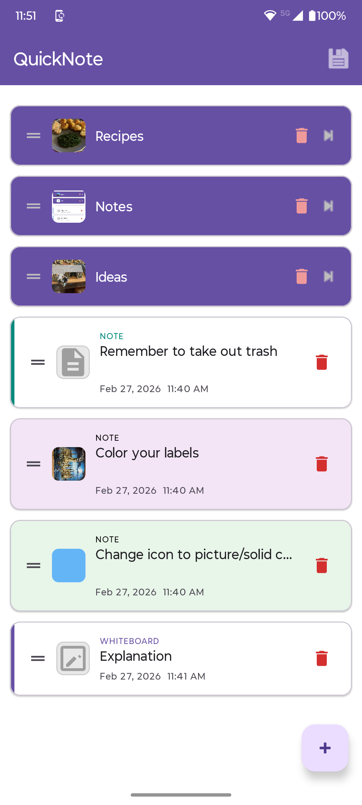
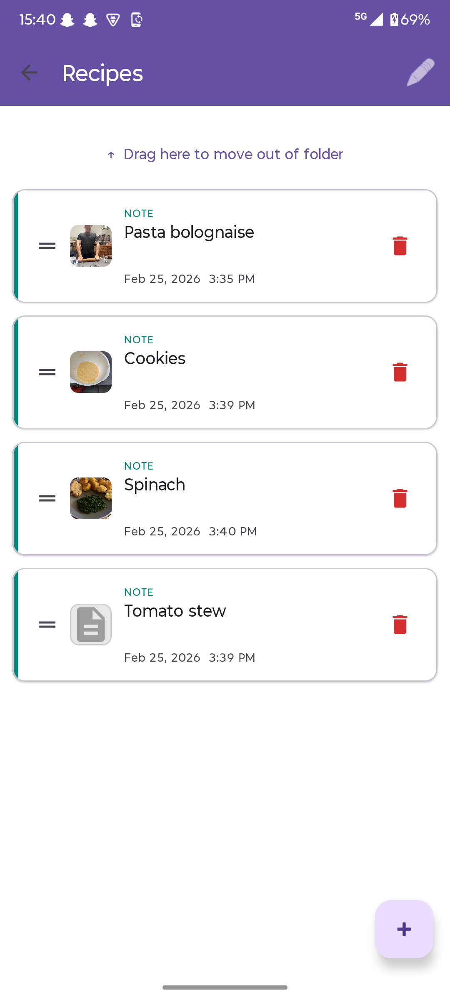
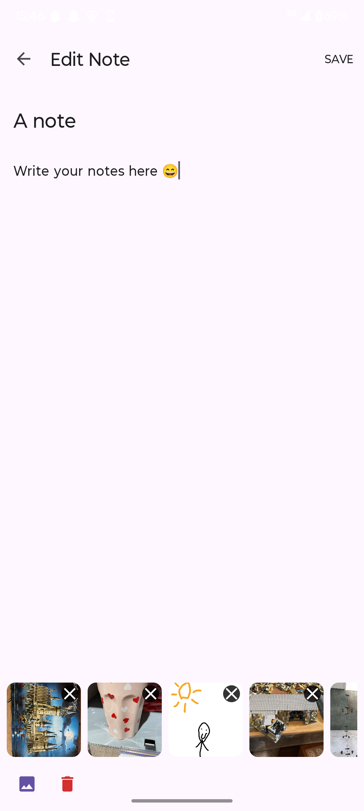
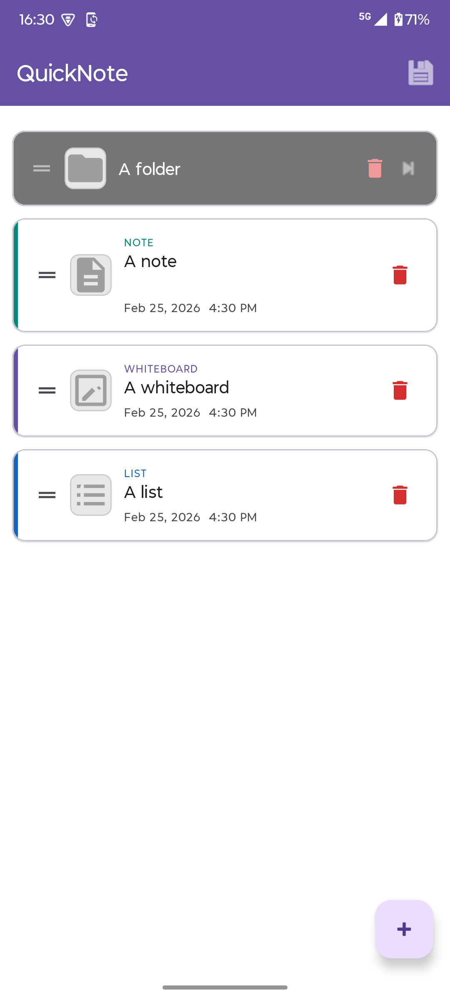
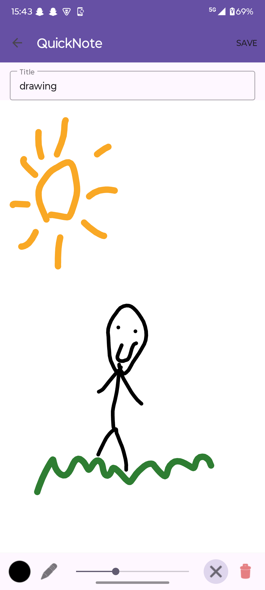
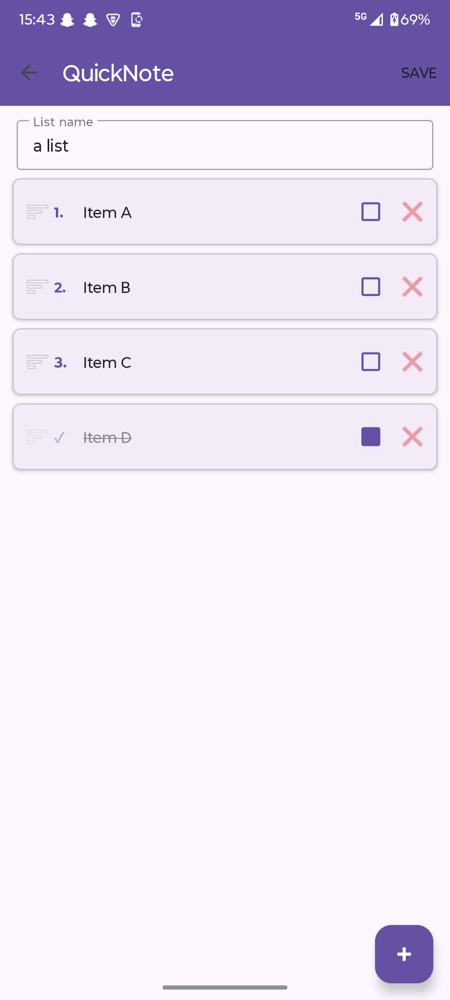

# QuickNote

An Android note-taking app where you can create notes, lists, whiteboards and folders — all in one place. Everything is stored locally on your phone, nothing goes to the cloud.

---

## Screenshots

  
  
  
  
  
  

---

## What it does

### Notes
- When you open the app you see all your notes, lists, whiteboards and folders as cards
- Each card shows the title, a preview of the text, and the date
- Tap a note to open and edit it
- Notes only save when you tap the **Save** button — going back without saving shows a warning and discards your changes
- Each note has a title and a body

### Lists
- A list is like a to-do list — you give it a name and then add items to it
- Every item gets a number based on its position
- Check off an item and it slides down to the bottom of the list; uncheck it and it slides back to where it was
- Drag items using the handle on the left to reorder them — numbers update automatically
- Long items grow the row to show all the text

### Whiteboards
- A blank canvas you can draw on with your finger
- Tools at the bottom: colour picker, pen size slider, eraser, and a clear-board button
- **Pan** with two fingers, **zoom** with a pinch
- Tap **Save** in the top bar to save; going back without saving shows a warning

### Folders
- Create folders to group things together — you can put folders inside folders
- Tap a folder to open it and see what's inside
- Folders look visually different from notes (darker card) so they're easy to spot

### Item types at a glance
Each card has a coloured left stripe so you always know what you're looking at:
- 🟢 **Note** — teal stripe
- 🔵 **List** — blue stripe
- 🟣 **Whiteboard** — purple stripe
- **Folder** — dark gray card (no stripe)

### Custom icons
- Tap the small square icon on any note, list, whiteboard or folder card to set a custom image for it
- The image is cropped to a square

### Adding things
- Tap the **+** button at the bottom right of any screen
- A menu pops up: New note, New list, New whiteboard, or New folder
- Inside a folder the same menu appears

### Deleting
- Every card has a red delete button (trash icon)
- Tapping it asks for confirmation before deleting
- Deleting a folder with content inside asks whether you want to delete the contents or move them out first

### Reordering
- Hold the handle icon (≡) on the left of any card and drag to reorder
- The order is saved between sessions

### Moving things into folders
- On the home screen, drag any item — as you hover your finger over a folder the card you're dragging gets darker to show it's about to be moved inside
- The move only triggers when the centre of the dragged card is directly over the folder
- Release to move it in, or drag somewhere else and release to just reorder
- Inside a folder there is a **"↑ Move out of folder"** bar at the top — drag an item onto it to move it back out
- At the bottom there is a **"Cancel"** zone — drag there and release to cancel the move

### Photos (in notes)
- Tap the image button inside a note to add photos
- Photos appear as small thumbnails in a strip at the bottom
- Tap a thumbnail to view it full screen; swipe left/right to browse, swipe down to close
- Tap the trash icon next to the add-photo button to enter remove mode — ✕ badges appear; tap one to remove that photo
- Long-press a thumbnail and drag to reorder photos

### Export / Import
- Tap the **save icon** in the top-right corner of the home screen
- Choose **Export** or **Import**

**Export:**
- If there's nothing to export, you'll see a warning
- If there is data, the app shows you the file size without pictures and with pictures
- Choose whether to include pictures or not, then pick where to save the `.qnbackup` file

**Import:**
- Choose whether to delete your current data first or keep it and merge
- Confirm, then pick a `.qnbackup` file
- Everything is restored — folders, notes, lists, whiteboards, photos and all

---

## Installing the debug APK

If you just want to try the app without building it yourself:

1. Download `app-debug.apk` from the repository (found in `app/build/outputs/apk/debug/`)
2. On your Android phone go to **Settings → Apps → Special app access → Install unknown apps**
3. Find your browser or file manager and enable **Allow from this source**
4. Open the APK file on your phone and tap **Install**
5. The app appears as **QuickNote** on your home screen

> The debug APK is signed with a standard Android debug key — it's fine for personal use but not for publishing to the Play Store.

---

## Tech stuff

- Built with Kotlin for Android
- Uses Room for local database storage
- MVVM architecture (ViewModel + LiveData)
- Material 3 design
- Backup/restore uses plain JSON (no external dependencies)
- Minimum Android version: Android 8.0 (API 26)
